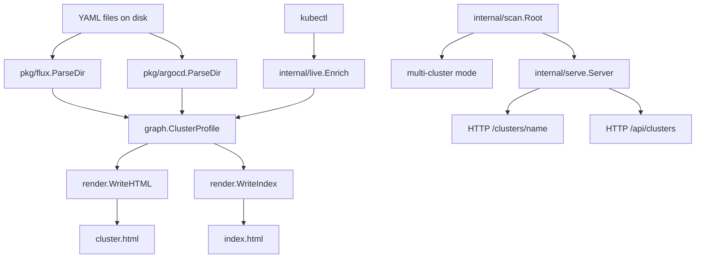

# Architecture

## Overview



## Package structure

```
cmd/
  clusterscope/
    main.go            # CLI entrypoint, flag parsing, mode dispatch

internal/
  graph/
    graph.go           # Shared data model: Node, Edge, Graph, ClusterProfile
  live/
    live.go            # kubectl enrichment (Flux + ArgoCD)
  render/
    render.go          # HTML generation (WriteHTML, WriteIndex)
    template.html      # D3.js cluster profile template
    index.html         # Multi-cluster dashboard template
    shell.html         # HTMX serve-mode shell
  repos/
    repos.go           # repos.yaml schema for git-sync mode
  scan/
    scan.go            # Cluster directory discovery + tech detection
  serve/
    serve.go           # HTTP server, file watcher, cluster cache

pkg/
  flux/
    parser.go          # Flux YAML parser (GitRepository, Kustomization, FluxInstance)
  argocd/
    parser.go          # ArgoCD parser (Application, ApplicationSet, AppProject)

kcl/                   # KCL deployment module (Kubernetes manifests)
dagger/                # Dagger CI module (lint, build, image, scan)
```

## Data flow

### Static mode

```
-dir <cluster>  →  ParseDir()  →  graph.ClusterProfile  →  WriteHTML()  →  .html file
-root <dir>     →  scan.Root() →  []ClusterProfile       →  WriteHTML() × N + WriteIndex()
```

### Serve mode

```
-serve :8080  →  serve.Start()
                 ├─ scanAll()  (on startup)
                 ├─ watch()    (fsnotify goroutine)
                 ├─ enrichAll() (if -live, periodic goroutine)
                 └─ HTTP handlers: /, /api/clusters, /clusters/<name>
```

### Live enrichment

```
live.Enrich(profile, kubeconfig)
  ├─ Flux:   kubectl get kustomizations + gitrepositories  →  status from Ready conditions
  └─ ArgoCD: kubectl get applications                       →  status from health + sync
```

## Technology detection

`internal/scan.DetectTech(dir)` reads YAML files in a directory and returns:

- `"argocd"` if any file contains `argoproj.io` or `kind: Application`
- `"flux"` otherwise
